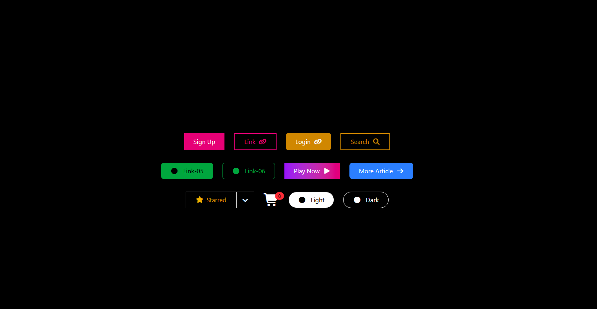

# Tailwind Buttons 

## 📌 Project Description

**Tailwind Button Showcase** is a simple web project that displays different types of buttons created using **Tailwind CSS** and **Font Awesome icons**.

This project is designed for learning and practicing Tailwind CSS button styles.

---

## 🎯 Features

* Sign Up Button
* Login Button
* Search Button
* Link Buttons
* Gradient Button
* Play Button
* Starred Dropdown Button
* Shopping Cart Icon
* Light & Dark Buttons

---

## 🛠 Technologies Used

* HTML5
* Tailwind CSS
* Font Awesome Icons

---


## 📂 Project Structure

```
project-folder/
│── index.html
│── README.md
```

---

## ▶ How to Run

1. Download or copy the project files
2. Save as **index.html**
3. Open the file in a web browser

---

## 🎨 Buttons Included

### Top Buttons

* Sign Up
* Link
* Login
* Search

### Middle Buttons

* Link-05
* Link-06
* Play Now
* More Article

### Bottom Buttons

* Starred Dropdown
* Shopping Cart
* Light Mode
* Dark Mode

---

## 🎓 Purpose

This project was created for:

* Learning Tailwind CSS
* Practicing UI Design
* Understanding Buttons
* Using Icons

---

## 🚀 Future Improvements

* Add Navbar
* Add Cards
* Add Footer
* Add Dark Mode Toggle
* Add Animations

---

## 👨‍💻 Author

Created by **ABHINAV ABIN**

---
